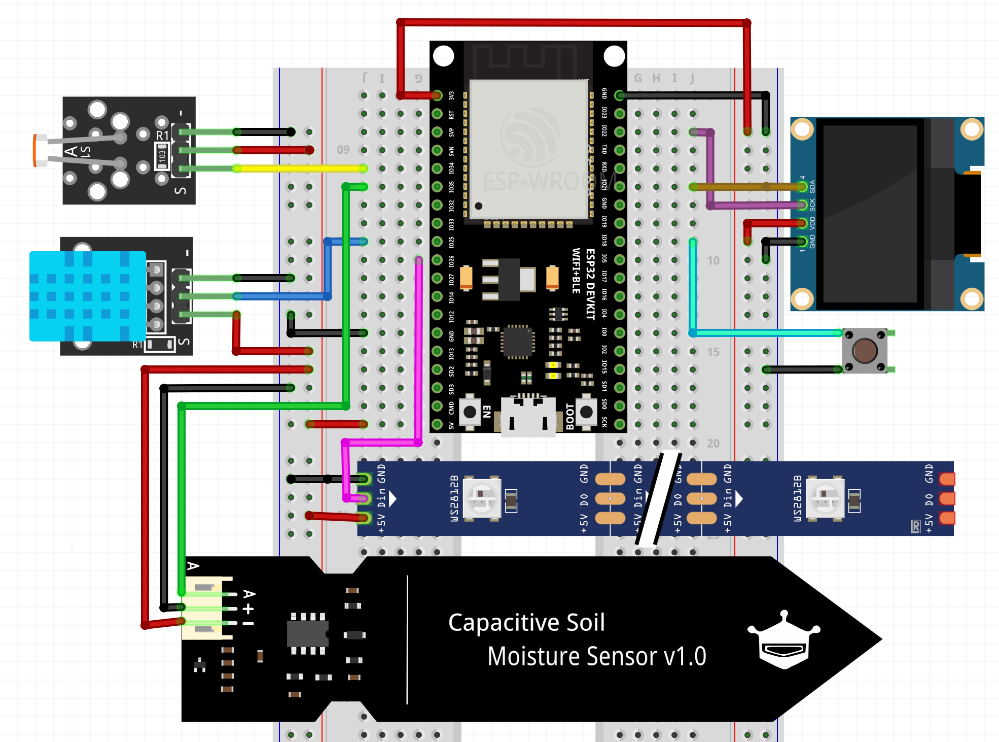

# Technion CS IOT Final Project: Smart Garden

## Team Members
- Roman Spector
- Gil Romano
- Roi Sasson

## Project Description
We built this project in the Makers Lab of the Faculty of Computer Science at the Technion. The goal is to create a smart device that enables easy monitoring of garden growing conditions through an application. It involves smart, consistent monitoring of personal garden environmental conditions using an ESP32 board. A compact box houses the board and sensors, connecting to the internet, with a dedicated application and database displaying sensor readings.
This repository contains all the resources for running it in your own. All you need is to assemble the hardware as the transcript below, compile the arduino folder using platform.io and compilr the app with flutter.
Certainly, here's the translated list of features, with additional elaboration:

**Hardware Features**
1. Real-time data measurement and display
   a. Noise filtration from sensor readings to ensure accurate measurements.
   b. A button for simple toggling between sensors, allowing for user-friendly navigation.
   c. Screen timeout setting, determining how long the display stays on before turning off to conserve power.

2. Real-time reporting on the operational status and connectivity of sensors, to ensure immediate detection of issues for timely resolution.

3. Automatic connection to the internet with consistent data transmission, allowing the system to send updated sensor data without manual intervention.

4. Real-time alerts for disconnection from the internet, so users can promptly address any connectivity issues.

**Application Features**
1. Display of all data as it is updated from the system, enabling users to see the latest information at a glance.

2. Data visualization in the form of graphs, sorted by hour, day, and week, which aids in identifying trends and changes in garden conditions over time.

3. Calibration of the soil moisture sensor to adjust it to the specific needs of the garden, ensuring accurate soil moisture readings.

4. Modification of device settings, providing flexibility to adapt to new requirements or improve performance.

5. The ability to switch internet networks directly from the device, facilitating easy changes to network settings without the need for additional equipment or complex procedures.

## List of Hardware
- ESP32 board
- 3 Neopixel LEDs
- Simple button
- 1.3-inch Monochrome OLED display (128*64 with alternate address)
- Temperature and Humidity sensor (DHT11)
- Light sensor
- Soil Moisture sensor

## Libraries and Versions
- Firebase Arduino Client Library for ESP8266 and ESP32 @ ^4.4.10
- Adafruit BME280 Library @ ^2.2.4
- Adafruit GFX Library @ ^1.11.9
- Adafruit SSD1306 @ ^2.5.9
- DHT sensor library @ ^1.4.6
- Adafruit NeoPixel @ ^1.12.0
- NTPClient @ ^3.2.1

## Folders Contained
- `arduino_smart_garden`: Hardware code
- `smart_garden_app`: Application code with Flutter
- `unit_tests`: Sensors and display tests

## Hardware Connectivity Graph

